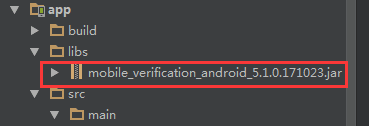

# 1. 开发环境配置
sdk技术问题沟通QQ群：609994083

## 1.1. 总体使用流程

1. 调用SDK方法来获得`token`，步骤如下：

    a. 构造SDK中认证工具类AuthnHelper的对象；</br>

    b. 使用AuthnHelper中的getToken方法，获得token。

2. 使用平台本机号码校验接口，进行号码校验

    </br>

## 1.2. 新建工程并导入SDK的jar文件

将`mobile_verification_android_*.jar`拷贝到应用工程的libs目录下，如没有该目录，可新建；




</br>

## 1.3. 配置AndroidManifest

注意：为避免出错，请直接从Demo中复制带<!-- required -->标签的代码

**配置权限**

```java
<uses-permission android:name="android.permission.INTERNET" />
<uses-permission android:name="android.permission.READ_PHONE_STATE" />
<uses-permission android:name="android.permission.ACCESS_WIFI_STATE" />
<uses-permission android:name="android.permission.ACCESS_NETWORK_STATE" />
<uses-permission android:name="android.permission.CHANGE_NETWORK_STATE" />
<uses-permission android:name="android.permission.WRITE_SETTINGS"/>

```


通过以上步骤，工程就已经配置完成了。接下来就可以在代码里使用统一认证的SDK进行开发了

</br>

## 1.4. SDK使用步骤

**1. 创建一个AuthnHelper实例** 

`AuthnHelper`是SDK的功能入口，所有的接口调用都得通过`AuthnHelper`进行调用。因此，调用SDK，首先需要创建一个`AuthnHelper`实例，其代码如下：

```java
public void onCreate(Bundle savedInstanceState) {
    super.onCreate(savedInstanceState);
    mContext = this;    
    ……
    mAuthnHelper = AuthnHelper.getInstance(mContext);
    }
```

**2. 实现回调**

所有的SDK接口调用，都会传入一个回调，用以接收SDK返回的调用结果。结果以`JsonObjent`的形式传递，`TokenListener`的实现示例代码如下：

```java
mListener = new TokenListener() {
    @Override
    public void onGetTokenComplete(JSONObject jObj) {
    	try {
               if (timer != null)
               timer.cancel();//回调的时候取消定时器
        } catch (Exception e) {
               e.printStackTrace();
        }
        if (jObj != null) {
            mResultString = jObj.toString();
            mHandler.sendEmptyMessage(RESULT);
            if (jObj.has("token")) {
                mtoken = jObj.optString("token");
            }
        }
    }
};
```

**3. 接口调用**

```java
mAuthnHelper.getToken(Constant.APP_ID, 
        Constant.APP_KEY,
        mListener);
```


<div STYLE="page-break-after: always;"></div>

# 2. SDK方法说明

## 2.1. 获取管理类的实例对象

### 2.1.1. 方法描述

获取管理类的实例对象

</br>

**原型**

```java
public AuthnHelper (Context context)
```

</br>

### 2.1.2. 参数说明

| 参数      | 类型      | 说明                              |
| ------- | ------- | ------------------------------- |
| context | Context | 调用者的上下文环境，其中activity中this即可以代表。 |

</br>

## 2.2. 获取校验凭证token

### 2.2.1. 方法描述

开发者向统一认证服务器获取用户身份标识`openId`和临时凭证`token`。</br>

**openId：**每个APP每个手机号码对应唯一的openId。</br>

**临时凭证token：**开发者服务端可凭临时凭证token通过3.1本机号码校验接口对本机号码进行验证。

**注意：获取凭证前，开发者需提前申请`READ_PHONE_STATE`权限，否则会失败！**

</br>

**原型**

```java
public void getToken(final String appId, 
            final String appKey, 
            final TokenListener listener)
```

</br>

### 2.2.2. 参数说明

**请求参数**

| 参数       | 类型            | 说明                                       |
| :------- | :------------ | :--------------------------------------- |
| appId    | String        | 应用的AppID                                 |
| appkey   | String        | 应用密钥                                     |
| listener | TokenListener | TokenListener为回调监听器，是一个java接口，需要调用者自己实现；TokenListener是接口中的认证登录token回调接口，OnGetTokenComplete是该接口中唯一的抽象方法，即void OnGetTokenComplete(JSONObject  jsonobj) |

**响应参数**

OnGetTokenComplete的参数JSONObject，含义如下：

| 字段          | 类型     | 含义                                       |
| ----------- | ------ | ---------------------------------------- |
| resultCode  | String | 接口返回码，“103000”为成功。具体响应码见4.1. 本机号码校验接口返回码 |
| authType    | String | 认证类型：0:其他；</br>1:WiFi下网关鉴权；</br>2:网关鉴权；  |
| authTypeDes | String | 认证类型描述，对应authType                        |
| resultDesc  | String | 失败时返回：返回错误码说明                            |
| token       | String | 成功时返回：临时凭证，token有效期2min，一次有效，同一用户（手机号）10分钟内获取token且未使用的数量不超过30个 |
| openId      | String | 成功时返回：用户身份唯一标识                           |

</br>

### 2.2.3. 示例

**请求示例代码**

```java
mAuthnHelper.getToken(Constant.APP_ID, 
        Constant.APP_KEY,
        mListener);
```

**响应示例代码**

```
{
    "resultCode": "103000",
    "authType": "2",
    "authTypeDes": "网关鉴权",
    "openId": "9M7RaoZH1Q95QzY99YFkeFDO4xDfOv5q4BVlwn_0zJNNlNYUkxrw",
    "token": "8484010001330200374D455979526A49354E6A59774E444D314E454E47516B4D3140687474703A2F2F3231312E3133362E31302E3133313A383038302F40303103000402D59A6B040012383030313230313730383138313031343437050010D2F28C555CB54316B7D031DE9F6F6B1EFF0020F07B4AAFC3B1499A250AAAB4272BBFB565B440FFA5C8257E90C28595956CC224"
}
```

## 2.3. 超时调用方法

### 2.3.1. 方法描述

接入方定时器超时调用方法。
当调用方对调用SDK 获取token 有时间限制时，可以实现一个定时器，当超时的时候SDK还没返回时，进行调用。

</br>

**原型**

```java
public void cancel()
```

</br>
### 2.3.2. 示例

**请求示例代码**

```java
private void getToken() {
        timer = new Timer();
        startOverdueTimer(); //获取 token 的时候启动定时器
        mAuthnHelper.getToken(Constant.APP_ID, Constant.APP_KEY, mListener);
    }

    private void startOverdueTimer() {
        timer.schedule(new TimerTask() {

            @Override
            public void run() {
                mAuthnHelper.cancel();//超时的时候进行调用
		Log.e(TAG, "超时了");
            }

        }, FORCE_TIMEOUT_TIME);
    }
```


<div STYLE="page-break-after: always;"></div>

# 3. 平台接口说明

## 3.1. 本机号码校验接口

校验用户输入的号码是否本机号码。
应用将手机号码传给统一认证SDK，统一认证SDK向统一认证服务端发起本机号码校验请求，统一认证服务端通过网关或者短信上行获取本机手机号码和第三方应用传输的手机号码进行校验，返回校验结果。</br>

### 3.1.1. 业务流程

SDK在获取token过程中，用户手机必须在打开数据网络情况下才能获取成功，纯wifi环境下会自动跳转到SDK的短信验证码页面（如果有配置）或者返回错误码。**注：本业务目前仅支持中国移动号码，建议开发者在使用该功能前，判断当前用户手机运营商**


</br>

### 3.1.2. 接口说明

**调用次数说明：**本产品属于收费业务，开发者未签订服务合同前，每天总调用次数有限，详情可咨询商务。

**请求地址：** https://www.cmpassport.com/openapi/rs/tokenValidate

**协议：** HTTPS

**请求方法：** POST+json

**回调地址：**请参考开发者接入流程文档

</br>

### 3.1.3.  参数说明

*1、json形式的报文交互必须是标准的json格式；*

*2、发送时请设置content type为 application/json*

**请求参数**

| 参数            | 类型     | 层级    | 约束                    | 说明                                       |
| ------------- | ------ | ----- | --------------------- | ---------------------------------------- |
| **header**    |        | **1** | 必选                    |                                          |
| version       | string | 2     | 必选                    | 版本号,初始版本号1.0,有升级后续调整                     |
| msgId         | string | 2     | 必选                    | 使用UUID标识请求的唯一性                           |
| timestamp     | string | 2     | 必选                    | 请求消息发送的系统时间，精确到毫秒，共17位，格式：20121227180001165 |
| appId         | string | 2     | 必选                    | 应用ID                                     |
| **body**      |        | **1** | 必选                    |                                          |
| openType      | String | 2     | 否，requestertype字段为0时是 | 运营商类型：</br>1:移动;</br>2:联通;</br>3:电信;</br>0:未知 |
| requesterType | String | 2     | 是                     | 请求方类型：</br>0:APP；</br>1:WAP              |
| message       | String | 2     | 否                     | 接入方预留参数，该参数会透传给通知接口，此参数需urlencode编码      |
| expandParams  | String | 2     | 否                     | 扩展参数格式：param1=value1\|param2=value2  方式传递，参数以竖线 \| 间隔方式传递，此参数需urlencode编码。 |
| phoneNum      | String | 2     | 是                     | 待校验的手机号码的64位sha256值，字母大写。（手机号码 + appKey + timestamp， “+”号为合并意思）（注：建议开发者对用户输入的手机号码的格式进行校验，增加校验通过的概率） |
| token         | String | 2     | 是                     | 身份标识，字符串形式的token                         |
| sign          | String | 2     | 是                     | 签名，HMACSHA256( appId +     msgId + phonNum + timestamp + token + version)，输出64位大写字母 （注：“+”号为合并意思，不包含在被加密的字符串中,appkey为秘钥, 参数名做自然排序（Java是用TreeMap进行的自然排序）） |
|               |        |       |                       |                                          |

**响应参数**

| 参数           | 层级    | 类型     | 约束   | 说明                                       |
| ------------ | ----- | :----- | :--- | :--------------------------------------- |
| **header**   | **1** |        | 必选   |                                          |
| msgId        | 2     | string | 必选   | 对应的请求消息中的msgid                           |
| timestamp    | 2     | string | 必选   | 响应消息发送的系统时间，精确到毫秒，共17位，格式：20121227180001165 |
| appId        | 2     | string | 必选   | 应用ID                                     |
| resultCode   | 2     | string | 必选   | 规则参见4.3平台返回码                             |
| **body**     | **1** |        | 必选   |                                          |
| resultDesc   | 2     | String | 必选   | 描述参见4.3平台返回码                             |
| message      | 2     | String | 否    | 接入方预留参数，该参数会透传给通知接口，此参数需urlencode编码      |
| expandParams | 2     | String | 否    | 扩展参数格式：param1=value1\|param2=value2  方式传递，参数以竖线 \| 间隔方式传递，此参数需urlencode编码。 |
|              |       |        |      |                                          |

</br>

### 3.1.4. 示例

**请求示例**

```
{
    "header":{
        "appId":"3000*****401",
        "timestamp":"20180104090953788",
        "version":"1.0",
        "msgId":"8ADFF305C7FCB3E1B1AECC130792FBD0"
    },
    "body":{
        "openType":"1",
        "token":"STsid0000001515028196605yc1oYNTuPlTlLT10AR3ywr2WApEq14JH",
        "sign":"227716D80112F953632E4AFBB71C987E9ABF4831ACDA5A7464E2D8F61F0A9477",
     "phoneNum":"38D19FF8CE10416A6F3048467CB6F7D57A44407CB198C6E8793FFB87FEDFA9B8",
        "requesterType":"0"
    }
}
```


**响应示例**

```
{
    "body":{
        "message":"",
        "resultDesc":"是本机号码"
    },
    "header":{
        "appId":"3000*****40",
        "msgId":"8ADFF305C7FCB3E1B1AECC130792FBD0",
        "resultCode":"000",
        "timestamp":"20180104090957277"
    }
}
```

<div STYLE="page-break-after: always;"></div>

# 4. 平台返回码说明

## 4.1. 本机号码校验接口返回码

本返回码表仅针对`本机号码校验接口`使用

| 返回码    | 说明              |
| ------ | --------------- |
| 000    | 是本机号码（纳入计费次数）   |
| 001    | 非本机号码（纳入计费次数）   |
| 002    | 取号失败            |
| 003    | 调用内部token校验接口失败 |
| 004    | 加密手机号码错误        |
| 102    | 参数无效            |
| 124    | 白名单校验失败         |
| 302    | sign校验失败        |
| 303    | 参数解析错误          |
| 606    | 验证Token失败       |
| 999    | 系统异常            |
| 102315 | 次数已用完           |

| 返回码 | 返回码描述                                 |
| ------ | ------------------------------------------ |
| 103000 | 成功                                       |
| 103101 | 签名错误                                   |
| 103103 | 用户不存在                                 |
| 103104 | 用户不支持这种登录方式                     |
| 103105 | 密码错误                                   |
| 103106 | 用户名错误                                 |
| 103107 | 已存在相同的随机数                         |
| 103108 | 短信验证码错误                             |
| 103109 | 短信验证码超时                             |
| 103111 | wap  网关IP错误                            |
| 103112 | 错误的请求                                 |
| 103113 | Token内容错误                              |
| 103114 | token验证KS过期                            |
| 103115 | token验证KS不存在                          |
| 103116 | token验证sqn错误                           |
| 103117 | mac异常                                    |
| 103118 | sourceid不存在                             |
| 103119 | appid不存在                                |
| 103120 | clientauth不存在                           |
| 103121 | passid不存在                               |
| 103122 | btid不存在                                 |
| 103123 | redisinfo不存在                            |
| 103124 | ksnaf校验不一致                            |
| 103125 | 手机号格式错误                             |
| 103127 | 证书验证：版本过期                         |
| 103128 | gba:webservice  error                      |
| 103129 | 获取短信验证码的msgtype异常                |
| 103130 | 新密码不能与当前密码相同                   |
| 103131 | 密码过于简单                               |
| 103132 | 用户注册失败                               |
| 103133 | sourceid不合法                             |
| 103134 | wap方式手机号码为空                        |
| 103135 | 昵称非法                                   |
| 103136 | 邮箱非法                                   |
| 103138 | appid已存在                                |
| 103139 | sourceid已存在                             |
| 103200 | 不需要更新ks错误                           |
| 103202 | 缓存用户不存在或者验证短信输入失败次数过多 |
| 103203 | 缓存用户不存在                             |
| 103204 | 缓存随机数不存                             |
| 103205 | 服务器异常                                 |
| 103207 | 发送短信失败                               |
| 103210 | 修改密码失败                               |
| 103211 | 其他错误                                   |
| 103212 | 校验密码失败                               |
| 103213 | 旧密码失败                                 |
| 103214 | 访问缓存或数据库错误                       |
| 103226 | sqn过小或过大                              |
| 103265 | 用户已存在                                 |
| 103270 | 随机校验凭证过期                           |
| 103271 | 随机校验凭证错误                           |
| 103272 | 随机校验凭证不存在                         |
| 103303 | sip  用户未开户（获取应用密码）            |
| 103304 | sip  用户未开户（注销用户）                |
| 103305 | sip  开户用户名错误                        |
| 103306 | sip  用户名不能为空（获取应用密码）        |
| 103307 | sip  用户名不能为空（注销用户）            |
| 103308 | sip  手机号不合法                          |
| 103309 | sip  opertype 为空                         |
| 103310 | sip  sourceid 不存在                       |
| 103311 | sip  sourceid 不合法                       |
| 103312 | sip  btid 不存在                           |
| 103313 | sip  ks 不存在                             |
| 103314 | sip密码变更失败                            |
| 103315 | sip密码推送失败                            |
| 103399 | sip  sys错误                               |
| 103400 | authorization  为空                        |
| 103401 | 签名消息为空                               |
| 103402 | 无效的  authWay                            |
| 103404 | 加密失败                                   |
| 103405 | 保存数据短信手机号为空                     |
| 103406 | 保存数据短信短信内容为空                   |
| 103407 | 此sourceId,  appPackage, sign已注册        |
| 103408 | 此sourceId注册已达上限   99次              |
| 103409 | query  为空                                |
| 103412 | 无效的请求                                 |
| 103413 | 系统异常                                   |
| 103414 | 参数效验异常                               |
| 103505 | 重放攻击                                   |
| 103511 | 源IP不合法                                 |
| 103810 | 校验失败，接口token版本不一致              |
| 103811 | token为空                                  |
| 103899 | aoi  token 其他错误                        |
| 103901 | 短信验证码下发次数已达上限                 |
| 103902 | 凭证校验失败                               |
| 103903 | 调用webservice错误                         |
| 103904 | 配置不存在                                 |
| 103905 | 获取手机号码错误                           |
| 103906 | 平台迁移访问错误  - （访问旧地址）         |
| 103911 | 请求过于频繁                               |
| 103920 | 没有存在的版本更新                         |
| 103921 | 下载时间戳超时                             |
| 103922 | 自动升级文件没找到                         |
| 104001 | APPID和APPKEY已存在                        |
| 104201 | 凭证已失效或不存在                         |
| 104202 | 短信验证失败过多                           |
| 105001 | 联通网关取号失败                           |
| 105002 | 移动网关取号失败                           |
| 105003 | 电信网关取号失败                           |
| 105004 | 短信上行ip检测不合法                       |
| 105005 | 短信上行发送信息为空                       |
| 105006 | 手机号码为空                               |
| 105007 | 手机号码格式错误                           |
| 105008 | 短信内容为空                               |
| 105009 | 解析失败                                   |
| 105010 | phonescript失效或者非法                    |
| 105011 | getPhonescript参数加密的私钥失效或者非法   |
| 105012 | 不支持电信取号                             |
| 105013 | 不支持联通取号                             |
| 105014 | 校验本机号码失败                           |
| 105015 | 校验有数三要素失败                         |
| 105018 | 用户权限不够                               |
| 105019 | 应用未授权                                 |

## 4.2. SDK返回码说明

| 返回码    | 返回码描述                             |
| ------ | --------------------------------- |
| 103000 | 成功                                |
| 102101 | 无网络                               |
| 102102 | 网络异常                              |
| 102103 | 未开启数据网络                           |
| 102121 | 用户取消登录                            |
| 102223 | 数据解析异常                            |
| 102203 | 输入参数错误                            |
| 102507 | 请求超时，预取号、buffer页取号、登录时请求超时        |
| 200002 | 手机未安装sim卡                         |
| 200005 | 用户未授权（READ_PHONE_STATE）           |
| 200006 | 用户未授权（SEND_SMS）                   |
| 200007 | authType仅使用短信验证码认证                |
| 200008 | 1. authType参数为空；2. authType参数不合法； |
| 200009 | 应用合法性校验失败                         |
| 200010 | 当前网络状态不支持的认证方式  |

</br>

# 5. Q&A常见问题
I、有关json形式报文发送为什么报参数解析错误
答:①json形式的报文交互必须是标准的json格式；②发送时请设置content type为 application/json

<div STYLE="page-break-after: always;"></div>
